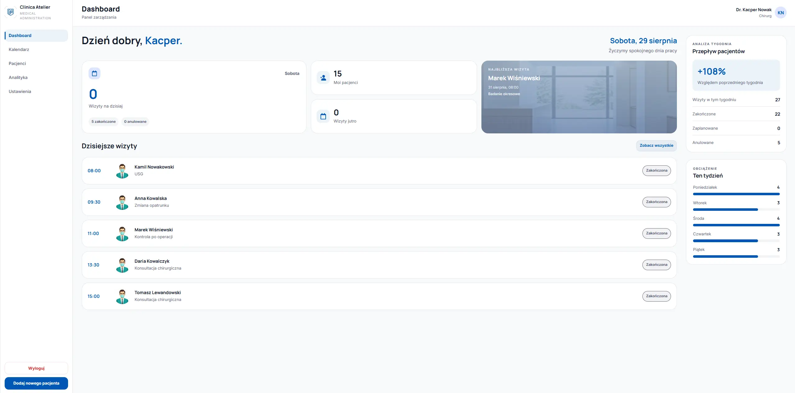
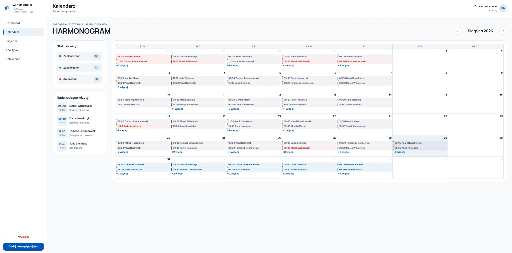
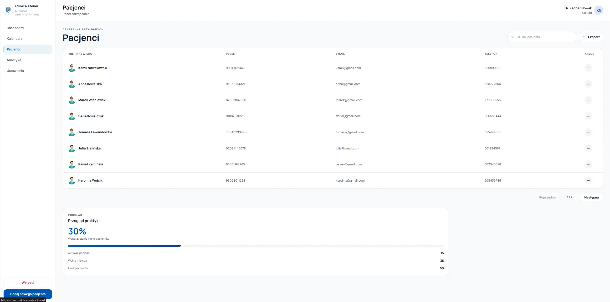
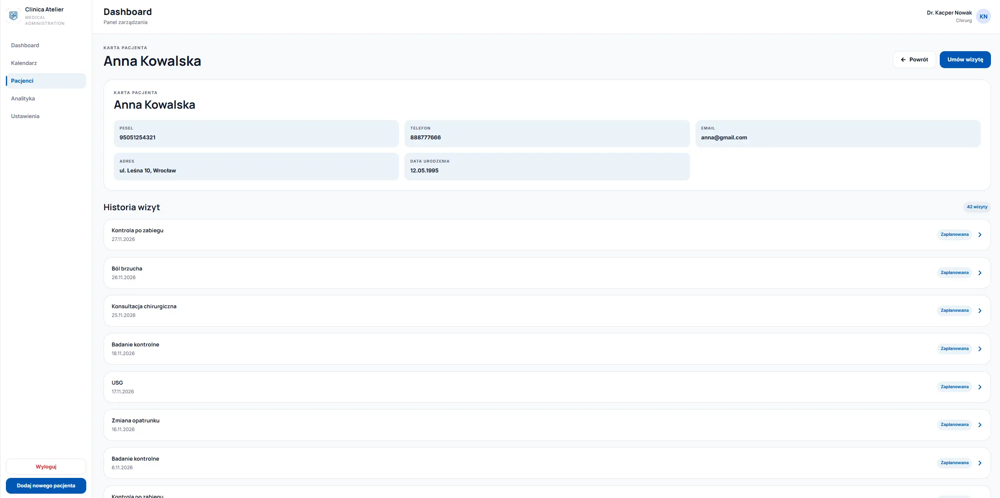
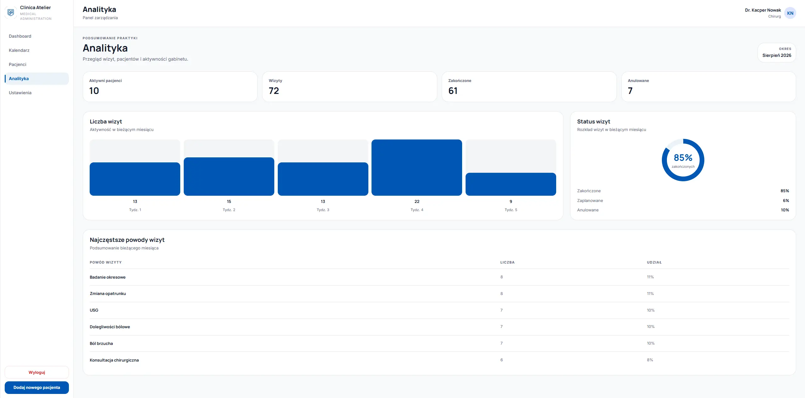
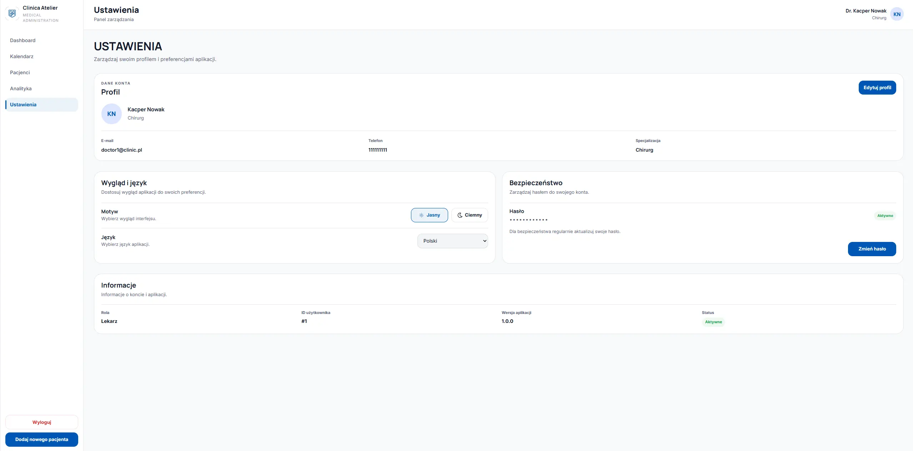
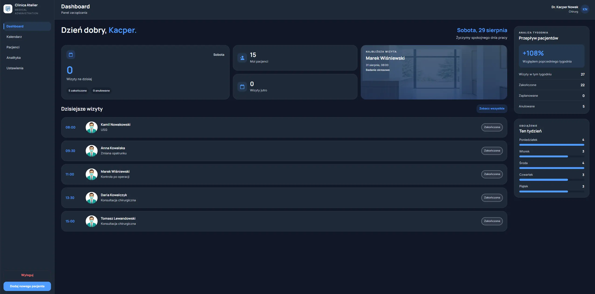

# Clinica Atelier

### Full-Stack Medical Practice Management System

Clinica Atelier is a full-stack web application designed for doctors and private medical practices to manage patients, appointments, visit history, and daily workflow from one centralized interface.

The project was built as a complete full-stack application — from responsive UI and authentication to REST API, relational database design, Docker-based local development, and cloud deployment.

> All patient and appointment data available in the demo environment is fictional and generated exclusively for demonstration purposes.

## Live Demo

**Application:** https://clinica-atelier.pl/

### Demo account

```text
Email: doctor1@clinic.pl
Password: 123456
```

The demo account is pre-populated with fictional patients, appointments, visit history, and different appointment statuses, so the main features can be explored immediately.

---

## Preview



---

## Features

### Dashboard

- Daily overview of the medical practice
- Appointment statistics
- Planned and completed visits
- Active patient information
- Today's appointments
- Patient-flow insights and notifications

### Patient Management

- Create and manage patient records
- Search and browse patients
- View detailed patient profiles
- Access appointment history
- Access previous visit notes
- Doctor-specific patient data isolation

### Appointment Management

- Create appointments
- Calendar-based appointment overview
- Planned, completed and canceled appointment states
- Appointment history
- Cancel appointments without deleting historical records
- Prevention of conflicting appointment times

### Medical Visit History

- Historical appointment records
- Visit notes connected with appointments
- Chronological patient history
- Doctor information associated with visits

### Authentication & Authorization

- User registration and login
- JWT-based authentication
- Password hashing with bcrypt
- Protected frontend routes
- Protected REST API endpoints
- Data scoped to the authenticated doctor

### User Interface

- Responsive design
- Mobile-first styling
- Dark mode support
- Reusable UI components
- Form validation
- Loading and error states
- Toast notifications

---

## Screenshots

### Dashboard


The dashboard provides a quick overview of the doctor's daily workflow, including appointments, patient statistics and important information.

### Application Overview

| Appointment Calendar                                            | Patients                                                            |
| --------------------------------------------------------------- | ------------------------------------------------------------------- |
|                      |                          |
| Manage and browse appointments through an interactive calendar. | Browse and manage patient records and access their medical history. |

| Patient Details                                                               | Analytics                                                                                 |
| ----------------------------------------------------------------------------- | ----------------------------------------------------------------------------------------- |
|                      |                                              |
| View patient information, appointment history and visit records in one place. | Monitor key practice statistics and gain insights into appointments and patient activity. |

| Settings                                                                 | Dark Mode                                                                  |
| ------------------------------------------------------------------------ | -------------------------------------------------------------------------- |
|                               |                               |
| Manage account information, profile details and application preferences. | Switch between light and dark themes for a comfortable viewing experience. |

---

## Tech Stack

### Frontend

| Technology      | Purpose                                  |
| --------------- | ---------------------------------------- |
| React           | User interface                           |
| TypeScript      | Type-safe frontend development           |
| Vite            | Development and production build tooling |
| React Router    | Client-side routing                      |
| Formik          | Form management                          |
| Yup             | Form validation                          |
| SCSS Modules    | Component-scoped styling                 |
| FullCalendar    | Appointment calendar                     |
| React Hot Toast | User notifications                       |

### Backend

| Technology     | Purpose                           |
| -------------- | --------------------------------- |
| Node.js        | JavaScript runtime                |
| Express        | REST API                          |
| Prisma ORM     | Database access and data modeling |
| PostgreSQL     | Relational database               |
| JSON Web Token | Authentication                    |
| bcrypt         | Password hashing                  |

### Infrastructure

| Technology     | Purpose                        |
| -------------- | ------------------------------ |
| Docker         | Local development environment  |
| Docker Compose | Multi-container orchestration  |
| Supabase       | Production PostgreSQL database |
| Render         | Backend hosting                |
| Hostinger      | Frontend hosting               |

---

## Architecture

```text
                         Clinica Atelier

                              User
                               │
                               ▼
                    ┌─────────────────────┐
                    │   React Frontend    │
                    │ TypeScript + Vite   │
                    │     Hostinger       │
                    └──────────┬──────────┘
                               │
                         HTTPS / REST API
                               │
                               ▼
                    ┌─────────────────────┐
                    │    Express API      │
                    │   Node.js + JWT     │
                    │       Render        │
                    └──────────┬──────────┘
                               │
                            Prisma
                               │
                               ▼
                    ┌─────────────────────┐
                    │     PostgreSQL      │
                    │      Supabase       │
                    └─────────────────────┘
```

The frontend communicates exclusively with the Express REST API.

Authentication and authorization are handled by the backend using JWT. Prisma provides the data-access layer between the API and PostgreSQL.

---

## Data Model

The application is centered around several related entities:

```text
User
 │
 └── Doctor
      │
      ├── Patients
      │     │
      │     ├── Appointments
      │     │
      │     └── Visit Notes
      │
      └── Appointments
```

Patient and appointment data is associated with a specific doctor, preventing users from accessing records belonging to another account.

Appointments support three lifecycle states:

```text
PLANNED
COMPLETED
CANCELED
```

Canceled appointments remain stored in the database to preserve historical records.

---

## Security

The application implements several authentication and data-protection mechanisms:

- Passwords are hashed using bcrypt
- Authentication is handled with signed JSON Web Tokens
- Protected API endpoints require a valid JWT
- Protected frontend routes prevent unauthenticated access
- Patient records are scoped to the authenticated doctor
- Database credentials and JWT secrets are stored in environment variables
- Sensitive configuration is excluded from version control

> This application is a portfolio project and is not intended for storing real medical or personally identifiable patient data.

---

## Running Locally

### Prerequisites

Make sure you have installed:

- Docker
- Docker Compose

Clone the repository:

```bash
git clone https://github.com/kacpi95/clinic-management-system.git
cd clinic-management-system
```

Start the development environment:

```bash
docker compose up --build
```

The application will be available at:

```text
Frontend: http://localhost:5173
Backend:  http://localhost:3000
```

PostgreSQL runs inside the Docker environment.

---

## Environment Variables

### Backend

Create a `.env` file inside the backend directory:

```env
DATABASE_URL=your_database_connection_string
DIRECT_URL=your_direct_database_connection_string
JWT_SECRET=your_jwt_secret
```

### Frontend

```env
VITE_API_URL=http://localhost:3000/api
```

---

## Database Setup

Prisma is used for database schema management.

Generate the Prisma client:

```bash
npx prisma generate
```

Apply existing migrations:

```bash
npx prisma migrate deploy
```

The project also includes seed data that can be used to populate the development/demo database with fictional doctors, patients, appointments and visit notes.

```bash
npx prisma db seed
```

---

## Docker Development Environment

The local development environment consists of three services:

```text
docker-compose
│
├── frontend
│   └── React + Vite
│
├── backend
│   └── Node.js + Express + Prisma
│
└── db
    └── PostgreSQL
```

Docker Compose handles service networking, database initialization and development dependencies.

---

## Project Structure

```text
clinica-atelier/
│
├── frontend/
│   ├── src/
│   │   ├── components/
│   │   ├── context/
│   │   ├── features/
│   │   ├── hooks/
│   │   ├── pages/
│   │   ├── routes/
│   │   ├── styles/
│   │   └── utils/
│   │
│   └── Dockerfile
│
├── backend/
│   ├── prisma/
│   ├── prismaClient/
│   ├── src/
│   ├── index.js
│   └── Dockerfile
│
├── docs/
│   └── screenshots/
│
├── docker-compose.yml
└── README.md
```

---

## Deployment

The production application uses a separated deployment architecture:

```text
Frontend
React + Vite
     │
     └── Hostinger

Backend
Node.js + Express + Prisma
     │
     └── Render

Database
PostgreSQL
     │
     └── Supabase
```

This separation keeps the frontend, API and database independently deployable while maintaining the same architecture used during local development.

---

## What This Project Demonstrates

Clinica Atelier was built to demonstrate practical full-stack development rather than only frontend presentation.

The project covers:

- Building a responsive React application with TypeScript
- Designing reusable UI components
- Managing application state and API communication
- Designing relational database models
- Building REST API endpoints with Express
- Implementing authentication and authorization
- Modeling relationships with Prisma
- Protecting user-specific resources
- Managing database migrations and seed data
- Containerizing a full-stack application
- Configuring development and production environments
- Deploying frontend, backend and database services independently

---

## Future Improvements

Potential future improvements include:

- Advanced patient filtering and sorting
- Appointment reminders
- Extended analytics
- Improved accessibility
- Automated testing
- API documentation
- Audit logs
- More granular user roles and permissions

---

## Disclaimer

Clinica Atelier is a portfolio and educational project.

All names, patients, appointments, medical records and other information presented in the demo environment are fictional and generated for demonstration purposes.

The application is **not intended for real-world medical data or clinical use**.

---

## Author

Developed as a full-stack portfolio project.

If you found the project interesting, feel free to explore the repository and the live demo.
